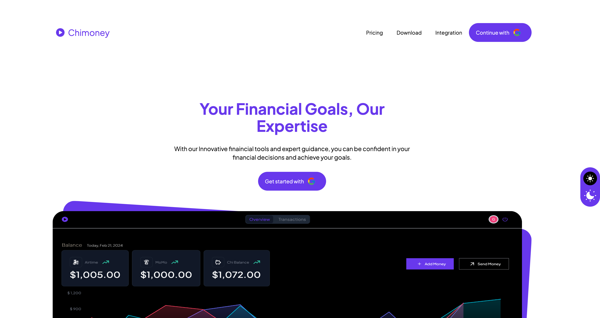

# Chimoney

    "A streamlined app that allows users to securely create and manage their accounts, send and receive payments, and view their transaction history, all integrated with Chimoney’s API and deployed live for easy access",



## LightHouse Score


[LIGHTHOUSE SCORE LINK](https://htmlpreview.github.io/?https://github.com/todak2000/chimoney/blob/main/lighthouse_results/desktop/chimoney_pi_vercel_app.html)

## URL

https://chimoney-pi.vercel.app/

## Built with

- ⚡️ Next.js 13
- ⚛️ React 18
- ✨ TypeScript
- 💨 Tailwind CSS 3
- ✨ Redux toolkit
- ✨ React Query
- ✨ Firebase reduxjs/toolkit
- ✨ reduxjs/toolkit
- ✨ Tremor React Library
- 🃏 Jest — Configured for unit testing

## Screens/Pages/Features

This project showcases a personal finance dashboard application built using modern web technologies and integrated with Chimoney's API. It allows users to manage their finances, track transactions, and send/receive payments seamlessly.Users can:

1. Landing Page

- Signup/Signin seamlessly using google auth only

2. Dashboard/Overview

- View their dashboard availing them their wallet balances (chi, momo and airtime).
- View a AreaChart Trend of their finances for a succint overview
- Send money to both chimoney users and non-users alike via
  - P2P - directly via wallet IDs (users)
  - Email just like paypal (users)
  - Bank account transfer from wallet (non-users)
- Recieve money from both chimoney users and non-users alike via
  - Payment link - Generate payment link for clients to pay into your chimoney wallet
  - Users themselves can top-up their wallet balance via Credit/Debit Card
- Navigate to `Transactions` to view their transactions
- Navigate to `Profile` by clicking on their profile icon to view their profiles
- Sign out by clicking the signout button and be reverted to the landing page

3. Transaction

- View their transactions as well paginated.
- Click on NEXT/PREVIOUS appriopriately to see subsequent transactions
- Filter transactions based on predefined options `CHI`, `MOMO`, `AIRTIME`, `Debit`, and `Credit`

4. Profile (Additional Features)

- View their profile page to see their details
- Edit/Update their details especially add/change their phone numbers
- Delete their Chimoney account in the event they deem it so

5. Currency Switch (Additional Features)

- Switch curreny between NGN and USD based on preference and all transaction data changes accordingly. i.e. if one chose NGN, transactions, payment and other money realted actions/events will be rendered to the user in NGN howbeit, default currency is the USD.

6. Theme Switch (Additional Features)

- Toggle between light `☀️` and dark `🌙` mode based on their preferences and seamless user experience
- View User profile Page
- Switch between USD and NGN with live interative Chart and updated Transaction

## Getting Started

These instructions will get you a copy of the project up and running on your local machine for development and testing purposes.

### Prerequisites

- Node.js v20
- npm/yarn
- Firebase account which allows you create a firebase project. see [setup here](https://firebase.google.com/codelabs/firebase-nextjs#0)
- TypeScript
- Chimoney Sandbox Developer account which allows you to create and access the enpoints with provided Keys/secrets. see [details here](https://chimoney.readme.io/reference/introduction)

## Installation

1. Clone this repository to your local machine:

```
git clone https://github.com/todak2000/chimoney.git

```

2. Navigate to the project directory and install the dependencies:

```
cd chimoney
yarn install
```

3. Set up your Firebase configuration in a `.env` file. - see `.env.example` as example env file for your reference

4. With the assumption that you have created your Chimoney sand box account, you add your api key to the `NEXT_PUBLIC_CHIMONEY_API_KEY` variable in the `.env` file. You can as well add a redirect url, this is important when implementing card payment as well as generating payment links for users.

## Development

6. Run Test if you so wish. Jest was used to implement unit Tests. see `__tests__` to run full test on all components. Run the following command:

```
yarn test
```

For specific components. Run the following command:

```
yarn test __tests__/unit/<TESTFILE>
```

e.g.`yarn test __tests__/unit/NotFound.test.tsx` where `<TESTFILE>` = `NotFound.test.tsx`.

7. Start the server in development mode:

```
yarn dev
```

The website will be available at `http://localhost:3000`.

## API Endpoints

Being a NextJS app which allows for both client and server side development, endpoints required to create, read, delete, update respective features can be found in `src/app/api` folder. Basically, Firebase (Database and Authentication), React Query (fetching, caching, and updating data) was used to build performant endpoints from chimoney - see documentation here `https://api-v2-sandbox.chimoney.io` . There are two subfolders `auth` and `other` which are apis for firebase google authentication and chimoney respectively. These endpoints were most used in different customized hooks here `src/app/hooks/index.ts`. For instance, the `useGetUserChimoneyDetails` hook referenced the `getAccountDetails` endpoint which allows for seamless querying of user data from chimoney while cross checking with firebase database as well - see `useAuthStateChange` for details.

## CI/CD and Deployment

This app was set up using CircleCI pipeline which allows for seamless transition of codebase to production artifacts as well as deployed to vercel. Only upon successful setup does it deploys to vercel

## License

This project is licensed under the MIT License - see the LICENSE file for details.

## Author

[Daniel Olagunju](https://github.com/todak2000)
